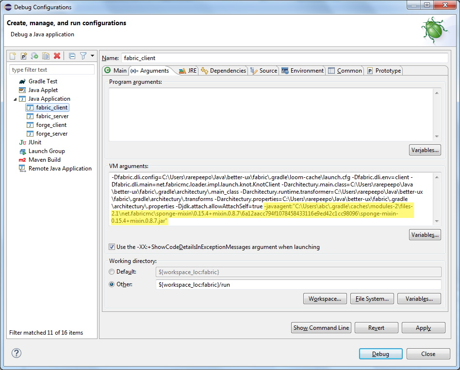
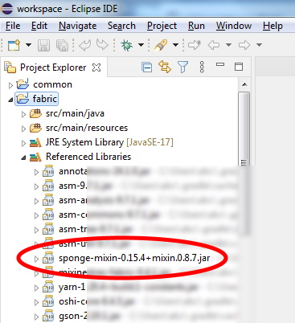

Notes to Future Self

### General
The mod uses the [Architectury](https://github.com/architectury) toolchain so that several mod loaders can be targeted with a single shared code base.

Stuff like the Java and Minecraft version and other mod meta data is configured in the `src/main/resources/fabric.mod.json` file for [fabric](https://fabricmc.net/) mods and in the `src/main/resources/META-INF/mods.toml` file for [forge](https://docs.minecraftforge.net/) mods, respectively.
  
For details, see:  
https://fabricmc.net/wiki/documentation:fabric_mod_json  
https://docs.minecraftforge.net/en/1.20.x/gettingstarted/modfiles/#modstoml  

### Mixins
Mixins are a powerful and important tool used in the Fabric ecosystem. Their primary use case is modifying existing code in the base game, whether it be through injecting custom logic, removing mechanics, or modifying values.
    
https://fabricmc.net/wiki/tutorial:mixin_introduction  
https://fabricmc.net/wiki/tutorial:terms  
https://fabricmc.net/wiki/tutorial:mixin_hotswaps

### Compiling and Building
Edit `run.bat` and set `JAVA_HOME` to the Java installation directory and then run `run.bat <task>` from a command-prompt.

Common tasks are:

* `tasks`  
Prints a list of all available tasks with a description of what they do.
* `build`  
Builds the mod. A separate `.jar` file will be created for each loader configuration and output to the respective loader's `/build/libs` directory.
* `clean`  
Deletes the `/build` directory.
* `eclipse`  
Creates Eclipse project files.
* `cleanEclipse`  
Deletes Eclipse project files.
* `genSources`  
Decompiles Minecraft sources.

  Allows you to view source of Minecraft classes from within Eclipse by shift clicking on them. You may have to recreate the Eclipse project files after running this.

  The decompiled sources can be found in `~/.gradle/caches/fabric-loom/decompile/v1.zip`. For whatever reason the filenames are hashes and the source code still contains some artifacts so I just wrote a script to turn them into human-readable form, see [fix_src.cs](fix_src.cs).

### Eclipse Settings

Because Mixins are injected at run-time you cannot hit breakpoints in the IDE but you can at least hot-swap them so that when you make a change in the source code the mixin will be automatically reloaded into minecraft.

To enable this functionality, you have to specify the `-javaagent` flag in Eclipse inside the VM options and have it point to a copy of the `sponge mixin jar` (whatever that is), like on the screenshot below. Fabric pulls the `sponge mixin jar` by default, so it should be located in the Gradle cache folder.

  

You can then launch the `better-ux_client` debug configuration to start minecraft.

Note: Architectury will configure the `.launch` files with it's own javaagent stuff when generating the Eclipse project files. It's buggy and not working properly at all for me though. Luckily it's not required and can just be replaced with the `sponge mixin jar` as described above.
